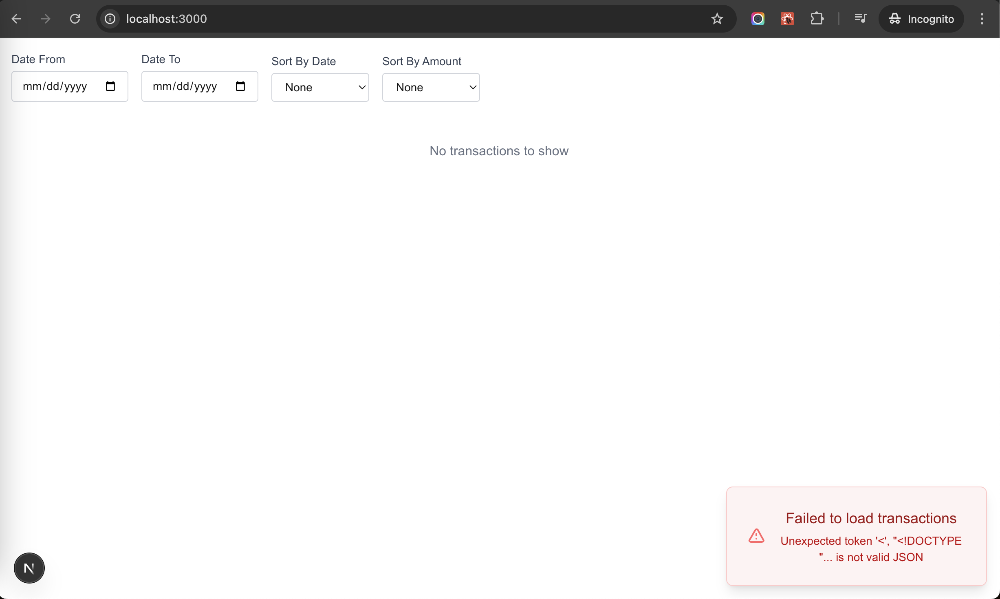
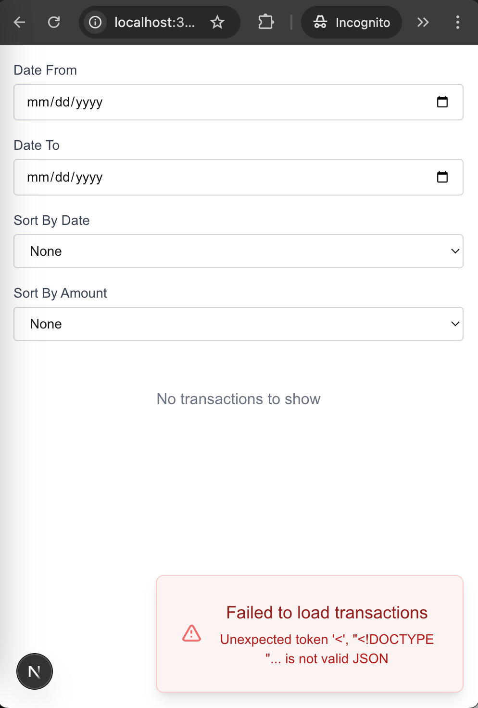

This project was done as a solution to an interview challenge.

## The challenge

Payment Transaction Dashboard

Estimated time for completion: 30 minutes

Problem Statement:
You are tasked with building a prototype of a payment transaction dashboard using React.js and TypeScript. Your goal is to create a web application that simulates displaying payment transaction data. The application should allow users to view a list of payment transactions and filter transactions by date range.

Requirements:
- Create a React.js application that displays a list of payment transactions.
- Implement a mock API to simulate fetching payment transaction data. You can use a JavaScript array to store mock data.
- Display the following information for each payment transaction: Transaction ID, Date, Description, Amount (in USD)
- Implement error handling for API requests. If the API request fails, display an error message to the user.
- Design the user interface to be clean and responsive using CSS and HTML. You can use any CSS framework or libraries of your choice..
- Add a date range filter to allow users to filter transactions by a specified date range.

Bonus Points (Optional):
- Implement pagination to show a limited number of transactions per page.
- Add sorting functionality to allow users to sort transactions by date or amount.
- Create a summary section that displays the total number of transactions and the total transaction amount within the selected date range.

Constraints:
- Third-party APIs are not allowed. You must use a mock API for data.
- You can use any libraries or packages you find suitable for this task.
- The application should be designed with best practices for performance, maintainability, and scalability in mind.

Evaluation Criteria:
- Code organization and structure.
- Correctness and functionality of the application.
- Proper error handling and user feedback.
- Code quality, adherence to TypeScript best practices, and readability.
- Responsive and visually appealing user interface

## Assumptions

- It is ok to filter the transactions in memory (the requirements say we can use an array so they should not be too much)

## Possible improvements

- Improve the BE by adding filters that prevent us to read all the transactions at once (in case transactions start to grow)
- Add the missing pagination

## Project tech definitions

To start I am using React.js and Typescript as requested by the challenge.

I am using Next.js for this project, mainly because it gives me the possibility to work with a BFF which in this case I used to simulate a real API.

I tried to sticked to Next definitions regarding project folders:
- I have my common components in a general components folder
- I have specific components inside the folder of the given feature
- I have an api folder for the BFF

For the UI I am using tailwind. I tried to keep it as simple and as clean as possible. You might ask why the table summary is at the bottom which makes it not visible unless you scroll down, the answer is because it was an optional so to me is not the mosst important information the user wants to see at first.

## How to run the app locally

```bash
npm install
npm run dev
```

## Error state

To get an error the easiest way is to change the api url for an invalid one.
Below I am attaching screenshots so you can see the result without having to run the app at all.


### Desktop


### Mobile


Open [http://localhost:3000](http://localhost:3000) with your browser to see the result.

## Live demo

You can access the app [here](https://payment-transaction-dashboard.vercel.app/).
